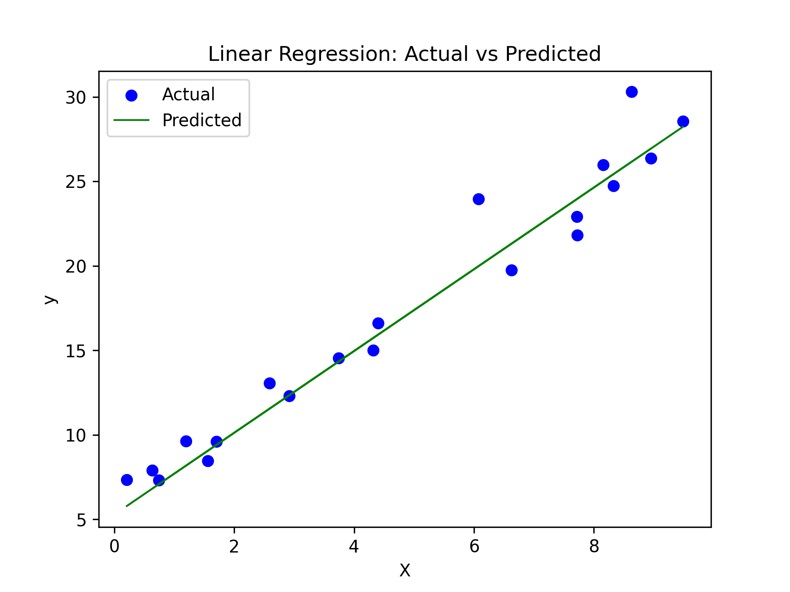

# Linear Regression in Python



Linear regression is one of the most fundamental machine learning algorithms, used to model the relationship between a dependent variable and one or more independent variables. This tutorial will guide you through implementing linear regression in Python using both scikit-learn and statsmodels.

## Prerequisites

First, install the required libraries:

```bash
pip install numpy pandas scikit-learn statsmodels matplotlib seaborn
```

## Understanding Linear Regression

Linear regression assumes a linear relationship between input variables (X) and the output variable (y):

**Simple Linear Regression:** y = β₀ + β₁X + ε

**Multiple Linear Regression:** y = β₀ + β₁X₁ + β₂X₂ + ... + βₙXₙ + ε

Where β₀ is the intercept, β₁...βₙ are coefficients, and ε is the error term.

## Method 1: Using scikit-learn

Scikit-learn is the most popular library for machine learning in Python. It's great for prediction-focused tasks.

### Simple Linear Regression

```python
import numpy as np
import pandas as pd
import matplotlib.pyplot as plt
from sklearn.linear_model import LinearRegression
from sklearn.model_selection import train_test_split
from sklearn.metrics import mean_squared_error, r2_score

# Create sample data
np.random.seed(42)
X = np.random.rand(100, 1) * 10  # 100 samples, 1 feature
y = 2.5 * X + np.random.randn(100, 1) * 2 + 5  # y = 2.5X + 5 + noise

# Split data into training and testing sets
X_train, X_test, y_train, y_test = train_test_split(
    X, y, test_size=0.2, random_state=42
)

# Create and train the model
model = LinearRegression()
model.fit(X_train, y_train)

# Make predictions
y_pred = model.predict(X_test)

# Evaluate the model
mse = mean_squared_error(y_test, y_pred)
r2 = r2_score(y_test, y_pred)

print(f"Coefficient: {model.coef_[0][0]:.2f}")
print(f"Intercept: {model.intercept_[0]:.2f}")
print(f"Mean Squared Error: {mse:.2f}")
print(f"R² Score: {r2:.2f}")

# Visualize results
plt.scatter(X_test, y_test, color='blue', label='Actual')
plt.plot(X_test, y_pred, color='red', linewidth=2, label='Predicted')
plt.xlabel('X')
plt.ylabel('y')
plt.title('Linear Regression: Actual vs Predicted')
plt.legend()
plt.show()
```

### Multiple Linear Regression

```python
# Create data with multiple features
np.random.seed(42)
X = np.random.rand(100, 3) * 10  # 100 samples, 3 features
y = 2 * X[:, 0] + 3 * X[:, 1] - 1.5 * X[:, 2] + np.random.randn(100) * 2 + 10

# Split the data
X_train, X_test, y_train, y_test = train_test_split(
    X, y, test_size=0.2, random_state=42
)

# Train the model
model = LinearRegression()
model.fit(X_train, y_train)

# Make predictions
y_pred = model.predict(X_test)

# Evaluate
mse = mean_squared_error(y_test, y_pred)
r2 = r2_score(y_test, y_pred)

print(f"Coefficients: {model.coef_}")
print(f"Intercept: {model.intercept_:.2f}")
print(f"Mean Squared Error: {mse:.2f}")
print(f"R² Score: {r2:.2f}")
```

## Method 2: Using statsmodels

Statsmodels is better for statistical inference and provides detailed statistical summaries.

```python
import statsmodels.api as sm

# Prepare data (using the multiple regression example)
X = np.random.rand(100, 3) * 10
y = 2 * X[:, 0] + 3 * X[:, 1] - 1.5 * X[:, 2] + np.random.randn(100) * 2 + 10

# Add constant term for intercept
X_with_const = sm.add_constant(X)

# Fit the model
model = sm.OLS(y, X_with_const)
results = model.fit()

# Print detailed summary
print(results.summary())

# Access specific statistics
print(f"\nCoefficients: {results.params}")
print(f"P-values: {results.pvalues}")
print(f"R² Score: {results.rsquared:.4f}")
print(f"Adjusted R²: {results.rsquared_adj:.4f}")
```

## Working with Real Data

Here's an example using a pandas DataFrame:

```python
# Create a sample dataset
data = {
    'square_feet': [1500, 1600, 1700, 1800, 1900, 2000, 2100, 2200, 2300, 2400],
    'bedrooms': [3, 3, 3, 4, 3, 4, 4, 4, 5, 5],
    'age_years': [10, 15, 5, 20, 8, 12, 3, 7, 15, 10],
    'price': [300000, 320000, 340000, 350000, 360000, 380000, 400000, 410000, 430000, 450000]
}
df = pd.DataFrame(data)

# Define features and target
X = df[['square_feet', 'bedrooms', 'age_years']]
y = df['price']

# Train-test split
X_train, X_test, y_train, y_test = train_test_split(
    X, y, test_size=0.2, random_state=42
)

# Train model
model = LinearRegression()
model.fit(X_train, y_train)

# Make predictions
y_pred = model.predict(X_test)

# Create a results dataframe
results_df = pd.DataFrame({
    'Actual': y_test,
    'Predicted': y_pred,
    'Difference': y_test - y_pred
})
print(results_df)

# Feature importance (coefficients)
feature_importance = pd.DataFrame({
    'Feature': X.columns,
    'Coefficient': model.coef_
}).sort_values('Coefficient', key=abs, ascending=False)
print("\nFeature Importance:")
print(feature_importance)
```

## Key Evaluation Metrics

```python
from sklearn.metrics import mean_absolute_error, mean_squared_error, r2_score

def evaluate_model(y_true, y_pred):
    mae = mean_absolute_error(y_true, y_pred)
    mse = mean_squared_error(y_true, y_pred)
    rmse = np.sqrt(mse)
    r2 = r2_score(y_true, y_pred)
    
    print(f"Mean Absolute Error (MAE): {mae:.2f}")
    print(f"Mean Squared Error (MSE): {mse:.2f}")
    print(f"Root Mean Squared Error (RMSE): {rmse:.2f}")
    print(f"R² Score: {r2:.4f}")
    
    return {'MAE': mae, 'MSE': mse, 'RMSE': rmse, 'R2': r2}

# Use the function
metrics = evaluate_model(y_test, y_pred)
```

## Common Issues and Best Practices

**Feature Scaling:** While linear regression doesn't strictly require feature scaling, it can improve numerical stability and make coefficients more interpretable.

```python
from sklearn.preprocessing import StandardScaler

scaler = StandardScaler()
X_train_scaled = scaler.fit_transform(X_train)
X_test_scaled = scaler.transform(X_test)

model.fit(X_train_scaled, y_train)
y_pred = model.predict(X_test_scaled)
```

**Checking Assumptions:** Linear regression assumes linearity, independence, homoscedasticity, and normality of residuals.

```python
# Plot residuals
residuals = y_test - y_pred
plt.scatter(y_pred, residuals)
plt.axhline(y=0, color='r', linestyle='--')
plt.xlabel('Predicted Values')
plt.ylabel('Residuals')
plt.title('Residual Plot')
plt.show()
```

**Handling Multicollinearity:** Check for highly correlated features.

```python
# Correlation matrix
correlation_matrix = df.corr()
print(correlation_matrix)

# Or use VIF (Variance Inflation Factor)
from statsmodels.stats.outliers_influence import variance_inflation_factor

vif_data = pd.DataFrame()
vif_data["Feature"] = X.columns
vif_data["VIF"] = [variance_inflation_factor(X.values, i) for i in range(X.shape[1])]
print(vif_data)
```

This tutorial covers the essentials of linear regression in Python. Start with simple examples and gradually move to more complex datasets. Remember to always validate your model's assumptions and evaluate performance on test data!
